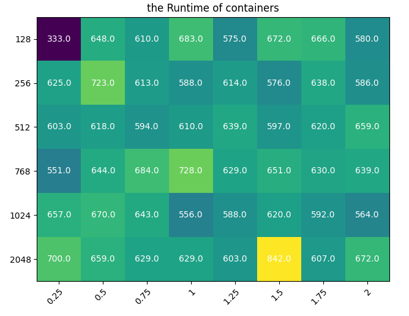

# Decoupling-Resources-in-Serverless-Applications
Some ideas and experiments to explore the possibility to optimizing the executing of serverless functions by decoupling CPU and memory

## Prelimiary Experiment
To test the possibility and feasibility of decoupling resources, we do a lot of experiment. We take some workloads written in python-docker, and put it into our own experiment code, and get the results as shown in the figure below

Apparently, the best configuration is not always the one provided by proportionla allocation strategy. So we are coming up with our own solution -a decouple resource allocation alogrithm.

## PQ Optimization
